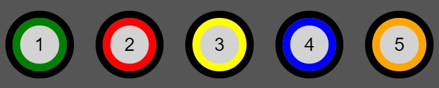
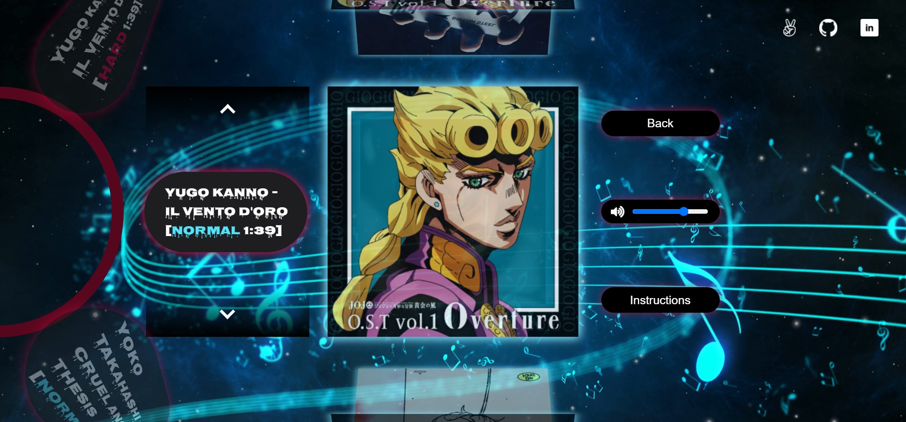

# Keytar Hero
[Live](https://linkedlists.github.io/Keytar-Hero/)

## Description

Keytar Hero is a Javascript and HTML Canvas music and rhythm game that is inspired by Guitar Hero. Players play through a song by timing the correct key presses for each note at the right time.


## Features
* Instructions modal
* Option to mute or change the volume of the song
* A 2D and 3D carousel wheel for song selection
* 12 second preview of songs that also implements volume swelling for gradual fade in and fade out of the song
* Game logic to handle single, multiple, and holding notes

## Gameplay
To play the game first select a song from either the 3D or 2D carousel wheels. Then when notes fall towards the center of the five colored targets, press the number key on the keyboard corresponding to the target to score points. For long notes you must hold down the key and release the key when the tail end of the note is near the center of the target.



### Selecting Songs


Cycle through songs by clicking the two arrow buttons bordering the title cards. Play the song by clicking the preview image or by clicking on the title card.
Both carousels rotate by dynamically changing the CSS depending on the index. The function `selectable` makes sure that only the current song on the carousel is clickable.
A `setTimeout` of 500ms is included so that a user does not enter into a game if they accidentally clicked a title while the carousel is rotating.

```js
  let selectableTimeout
  function selectable() {
    let index = wheelIndex % carouselWheelLength
    if (index < 0) {
      index *= -1
    }
    else if (index > 0) {
      index = 6 - index
    }
    songCarouselWheelItems[index].style.transform = 
          `rotate(${degrees[index]}deg) 
          perspective(0px) 
          rotateY(0deg) 
          translate(-50%, -50%)`
    songCarouselWheelItems[index].style.opacity = `1`
    previewCarouselItems[index].style.cursor = 'pointer'
    previewCarouselItems[index].style.opacity = '0.92'

    clearTimeout(selectableTimeout)
    selectableTimeout = setTimeout(() => {
      songCarouselWheelItems[index].classList.add("selectable")
      previewCarouselImg[index].classList.add("selectable-preview")
    }, 500)
    audioPreviewLoop(index)
  }
```
When a song is made selectable a 12 second preview of the song is played and looped. When a preview starts playing there is a gradual increase in the volume, and when the preview
ends `volumeDown` gradually brings the volume down. This is done to prevent the volume from coming in and out abruptly for a good user experience. A series of `clearInterval` and 
`clearTimeout` are in place to clear the previous previews when cycling to a new preview.

```js
  let loop
  function audioPreviewLoop(index = currentPreviewIndex) {
    clearInterval(loop)
    clearTimeout(previewTimeout)
    volumeDown()
    audioPreview(index)
    loop = setInterval( () => {
      clearTimeout(previewTimeout)
      clearInterval(intervalDown)
      clearInterval(intervalUp)
      volumeDown()
      audioPreview(index)
    }, 12000)
  }
```


### Notes

Each note holds information on which target they belong to, the tempo of the note, if the note is a single note or a holding note, and if the note needs to be paired
with another note.

```js
  { x: CONSTANTS.pos1, y: 0, pos: 0, tempo: 1, hold: 0, chain: true },
  { x: CONSTANTS.pos3, y: 0, pos: 2, tempo: 1, hold: 0, chain: true },
  { tempo: 6, hold: 0, chain: false, rest: true },
```

### Note Rendering

* `setInterval`

```js
  generateNotes() {
    this.callGenerateNotes = setInterval( () => {
      this.playNotes()
    }, this.currentSong.tempo)
  }
```
* `this.intervalValue`
* `this.counter` 1 or 2

```js
  playNotes() {
    this.intervalValue += 1
    this.counter++;
    if (this.allNotes.length > 0) {
      if (this.allNotes[0].rest) {
        this.counter -= this.allNotes[0].tempo;
        this.allNotes.shift();
      }
      else if (this.allNotes[0].kill) {
        this.counter += 1;
        this.allNotes.shift();
      }
      if (this.counter === 1 && this.allNotes[0].tempo > 1) {
        this.noteGrabber();
        this.counter = 0;
      }
      else if (this.counter === 2) {
        this.counter = 0;
        this.noteGrabber();
      }
    }
  }
```
### Note Collision

To check for note collision, an event listener is tied to each number key on `keydown`  which calls `checkCollisionDown` to see if the note is in bounds of its target.

```js
  handleKeyDown(e) {
    if (e.key == "1" && !this.keyLock1) {
      this.keyLock1 = true;
      this.checkCollisionDown(0)
    }
    .
    .
  }
```
If a player holds down a key then `checkCollisionDown` will constantly fire and will hit any note that enters the target's boundaries. To ensure that `checkCollisionDown` is only fired on a single `keydown` event, a lock is set and is only set `false` on an event listener that checks for a `keyup` event.
The `keyup` event listener calls `checkCollisionUp` to see if the player releases a key press when the tail end of a holding note is in the target's boundaries.
```js
  handleKeyUp(e) {
    if (e.key == "1") {
      this.keyLock1 = false;
      this.checkCollisionUp(0)
    } 
    .
    .
```

## Technical Challenges
Sync issues
### Pause/Resume

* `setInterval` difference

```js
  let dif = this.currentSong.tempo - this.intervalValue - 45
  dif = dif < 0 ? 0 : dif
  this.resumeTimeout = setTimeout( () => {
      this.playNotes()
      this.callGenerateNotes = setInterval( () => {
      this.playNotes()
    }, this.currentSong.tempo)
  }, dif)
```
* Tying interval to `requestAnimationFrame`

## Future Features
* Increased score variations depending on the player's accuracy and combo number
* Improved indication to let the player know if a note was hit or missed
* Sound effects
* A progress bar to let the player know the remaining time of a game.